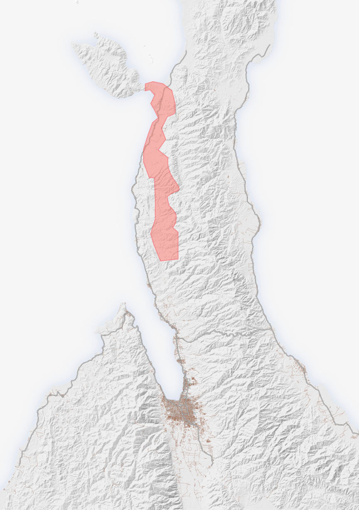

Here collection of all the maps I have made throughout the last year. There will be a date underneath and a tiny description.

This map was made to show data of estimated bachelor's degrees percentage in the next 5 Years. Fall 2022

This map's purpose was an extra credit assignment tasked with reflecting a map published by the New York Times. The original map is shown below. I used QGIS and Adobe Illustrator. Fall 2022

This map was made to use NLCD land classes and hillshades together and make an asthetically pleasing and informative map. Spring 2023

This map uses population data and percent of the population that works from home. I challenged myself to use a bivariate color scheme in QGIS. Fall 2022

(1).png)
This map's task was to organize copious amounts of layers and information in Adobe Illustrator into a more digestable and informative map. Fall 2022

This map was used to assist with field mapping one day in class. We took a section of campus and using ArcPython in ArcGIS pro we made digital elevation and digital surface models to map tree heights. Spring 2023