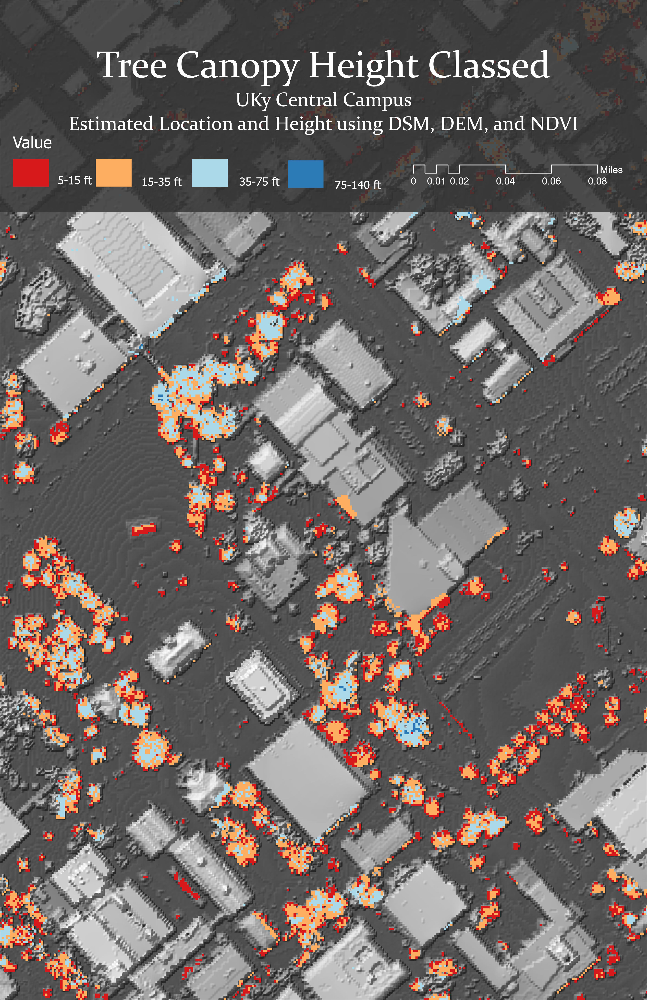
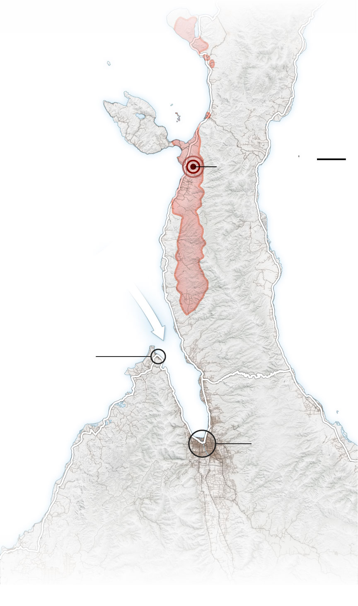

# Here collection of all the maps I have made throughout ny 3 years in the UK Geography Department. There will be a date underneath and a tiny description.

This map was part one of my GIS Applications for Health class. Made with ArcGIS Pro. Spring 2024

This is the second part of the Final Project in GIS Applications for health. It is meant to compare population density and the service area times for Fire and EMS. Spring 2024

This map was one of the first I had made in my college education. It was made with QGIS. Fall 2021

This map was made to show data of estimated bachelor's degrees percentage in the next 5 Years. Fall 2022

This map was meant to practice making informative maps that are still appealing to the eye. Made with QGIS and Adobe Illustrator. Fall 2022

This map was similar to the previous, as practice making eye appealing maps while still respecting the projection and data shown. Made with QGIS and Adobe Illustrator. Fall 2022

This map was made to use NLCD land classes and hillshades together and make an asthetically pleasing and informative map. Spring 2023

This map uses population data and percent of the population that works from home. I challenged myself to use a bivariate color scheme in QGIS. Fall 2022

(1).png)
This map's task was to organize copious amounts of layers and information in Adobe Illustrator into a more digestable and informative map. Fall 2022

This map was used to assist with field mapping one day in class. We took a section of campus and using ArcPython in ArcGIS pro we made digital elevation and digital surface models to map tree heights. Spring 2023

This map's purpose was an extra credit assignment tasked with reflecting a map published by the New York Times. The original map is shown below. I used QGIS and Adobe Illustrator. Fall 2022

