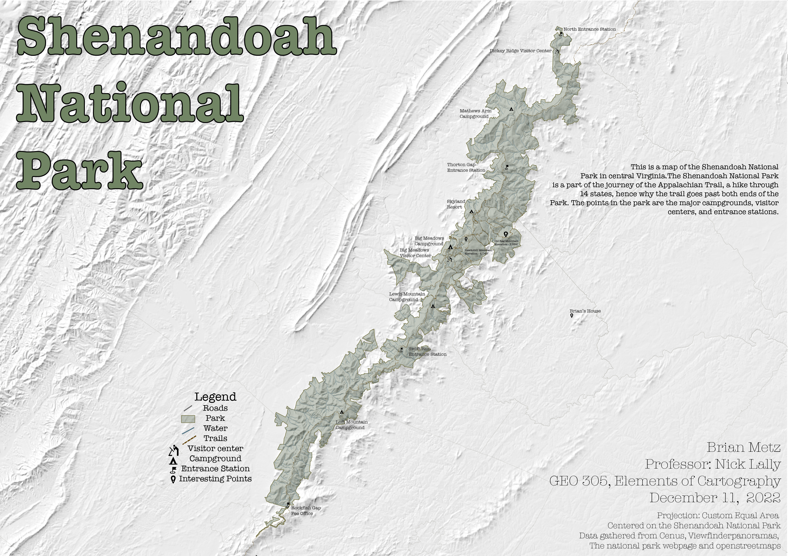

# This page showcases complete labs and projects that I have created. Most Projects will be from Fall of 2022 and Spring of 2023.

# Final Project - Geo 305: Elements of Cartography - Fall 2022

The purpose of this class was to practice making maps that are more appealing to the eyes. We focused less on the data driven maps and more thematic and artistic maps. Since I am from Virginia I chose to make a map of the Shenandoah National Park and the trails inside it. I used QGIS along with Adobe Photoshop and Illustrator.

 

# Lab 05: Exploring Kentucky LiDAR -  Geo 409: Advanced GIS - Spring 2023

This lab's purpose was to create and animate a scene using LiDAR data gathered from the state database KyFromAbove. I chose an area of I-75 that has lots of elevation change to example the usefulness of LiDAR point clouds compared to digital surface models. I also was tasked with making an animation in ArcGIS pro. I think this turned out really well. 

     

     
*[I-75 & Kentucky River - Mile Marker 89](https://youtu.be/nSUdGtuF7i0)*
