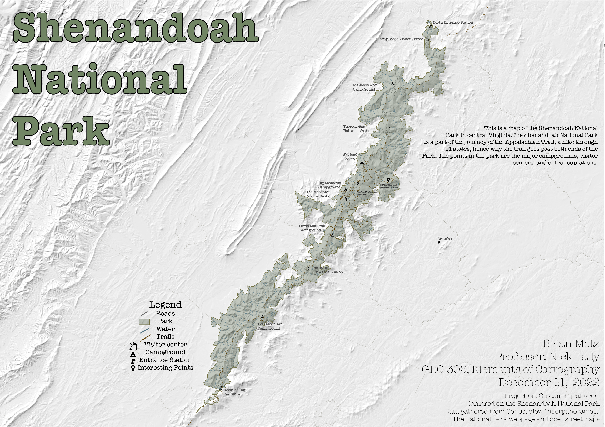
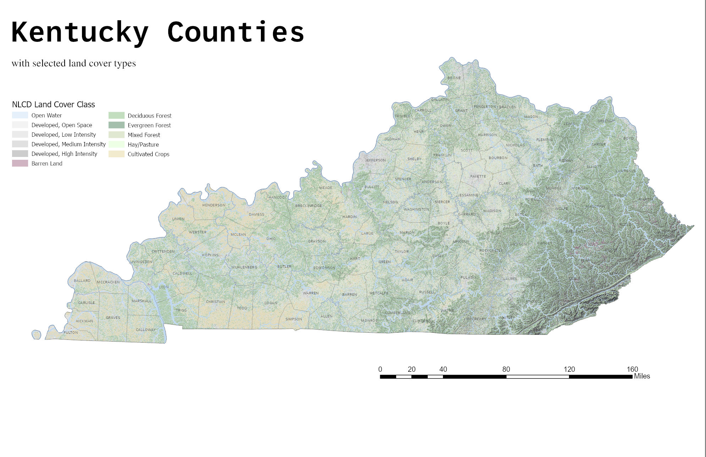

# Cartography Portfolio - Brian Metz

*Hi! Thanks for stopping by my portfolio. I am a junior at The University of Kentucky studying Geography (Mapping and GIS) and French, with a minor in Business. These are a collections of maps I have made through my time here at UK. Each map will have a date next to it to see the growth and change of my ability over time. Below are some of the few I have made and links to certains projects and a collection of all the maps I've made. Thanks again for looking at my portfolio*

  
