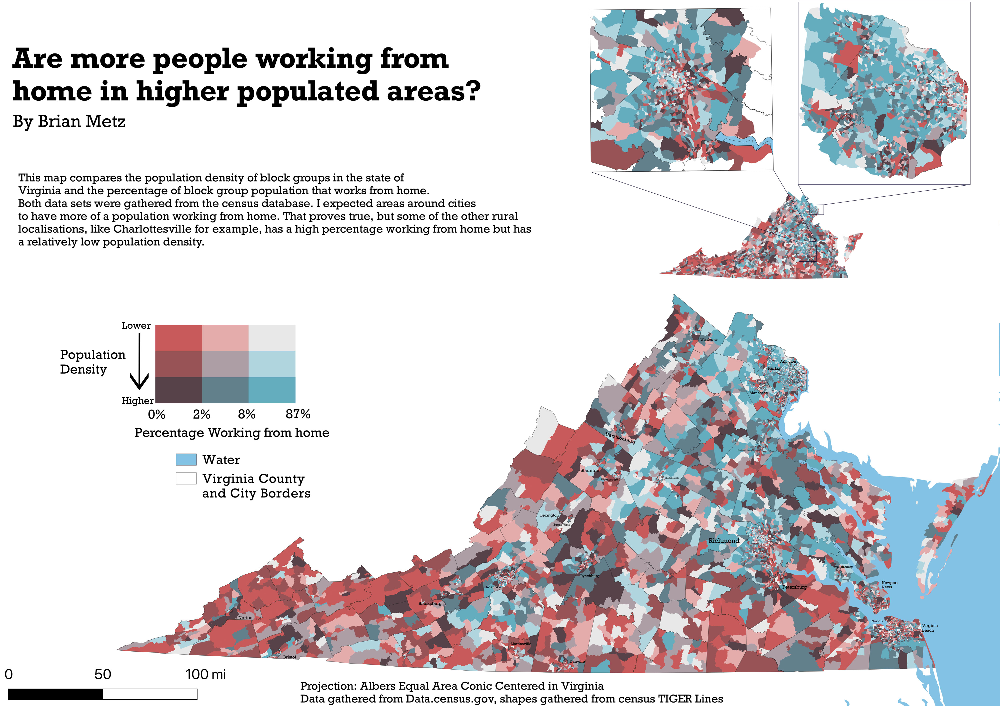
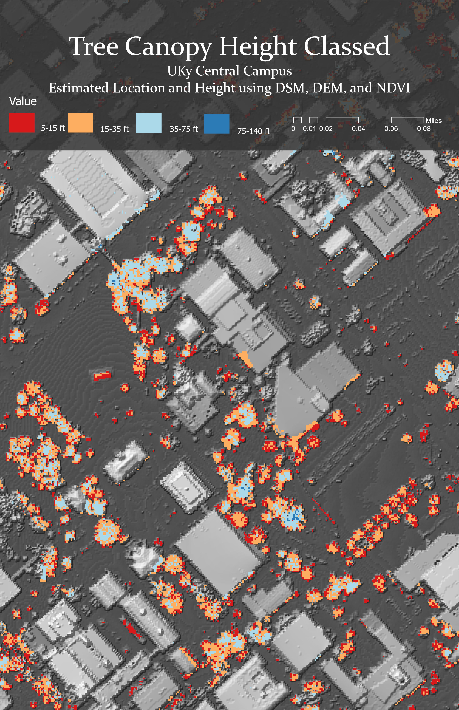
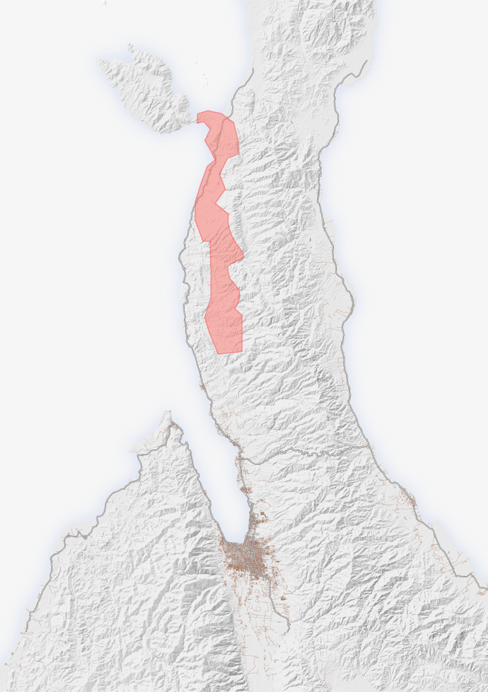
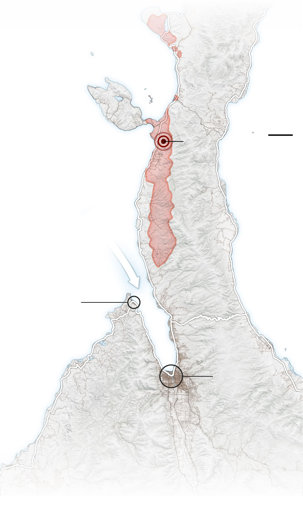

# Geographic Portfolio - Brian Metz

[Follow this link to see the completed projects from my undergradutate career](Projects.md)

[Follow this link to see all the maps that I have created at the University of Kentucky](Map_Library.md) 

   
This map uses population data and percent of the population that works from home. I challenged myself to use a bivariate color scheme in QGIS. Fall 2022

## Final Project - Geo 305: Elements of Cartography - Fall 2022

The purpose of this class was to practice making maps that are more appealing to the eyes. We focused less on the data driven maps and more thematic and artistic maps. Since I am from Virginia I chose to make a map of the Shenandoah National Park and the trails inside it. I used QGIS along with Adobe Photoshop and Illustrator.

 

## Lab 05: Exploring Kentucky LiDAR -  Geo 409: Advanced GIS - Spring 2023

This lab's purpose was to create and animate a scene using LiDAR data gathered from the state database KyFromAbove. I chose an area of I-75 that has lots of elevation change to example the usefulness of LiDAR point clouds compared to digital surface models. I also was tasked with making an animation in ArcGIS pro. I think this turned out really well. 

     

     
Video animation: *[I-75 & Kentucky River - Mile Marker 89](https://youtu.be/nSUdGtuF7i0)*

## Other projects

   
This map was made to use NLCD land classes and hillshades together and make an asthetically pleasing and informative map. Spring 2023

   
This map was made to show data of estimated bachelor's degrees percentage in the next 5 Years. Fall 2022

(1).png)   
This map's task was to organize copious amounts of layers and information in Adobe Illustrator into a more digestable and informative map. Fall 2022

   
This map was used to assist with field mapping one day in class. We took a section of campus and using ArcPy in ArcGIS pro we made digital elevation and digital surface models to map tree heights. Spring 2023

This map's purpose was an extra credit assignment tasked with reflecting a map published by the New York Times. The original map is shown below. I used QGIS and Adobe Illustrator. Fall 2022

